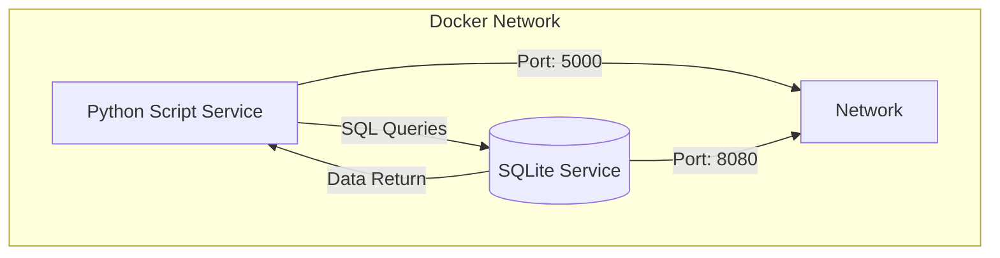
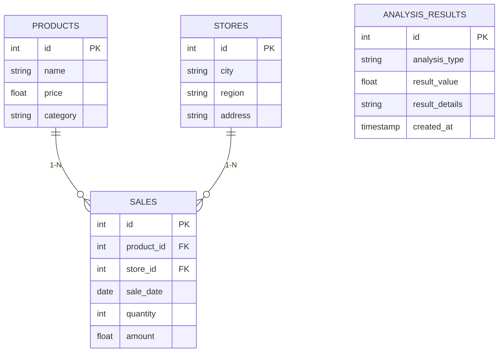
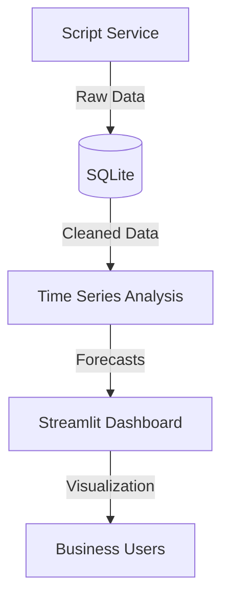

# SimplonCo_DataEngineer_Project: Sales Analysis for an SME

## Project Overview
This project involves creating a two-service architecture to analyze sales data for a small-to-medium enterprise (SME). The goal is to help the client understand sales dynamics over time and across regions to improve strategic decision-making.

---

## Project Architecture

### Architecture Diagram



**Service Description:**  

| **Service**               | **Description**                                                                 | **Port** |
|---------------------------|---------------------------------------------------------------------------------|----------|
| **Script Service**        | Executes Python scripts for data processing (import, analysis)                  | 5000     |
| **Database Service**      | Stores data in SQLite and responds to SQL queries                               | 8080     |

**Communication:**  
- The **Script Service** sends SQL queries to the **Database Service** via port `8080`  
- The **Database Service** exposes port `8080` to accept connections  
- The **Script Service** runs only after the **Database Service** starts  

---

## Technical Implementation

### 1. Docker Configuration

**Dockerfile (Python Service):**  
```dockerfile
FROM python:3.9-slim
WORKDIR /app
COPY requirements.txt .
RUN pip install -r requirements.txt
COPY . .
CMD ["python", "main.py"]
```

**docker-compose.yml:**  
```yaml
version: '3.8'
services:
  script_service:
    build: .
    ports:
      - "5000:5000"
    depends_on:
      - db_service
    volumes:
      - .:/app

  db_service:
    image: nouchka/sqlite3
    ports:
      - "8080:8080"
    volumes:
      - ./data:/data
```

---

### 2. Database Schema



---

### 3. Analysis Scripts (main.py)

```python
import sqlite3
import requests
import pandas as pd
from datetime import datetime

def setup_database():
    conn = sqlite3.connect('data/sales.db')
    cursor = conn.cursor()
    
    cursor.execute('''
    CREATE TABLE IF NOT EXISTS products (
        id INTEGER PRIMARY KEY,
        name TEXT,
        price REAL,
        category TEXT
    )
    ''')
    
    cursor.execute('''
    CREATE TABLE IF NOT EXISTS stores (
        id INTEGER PRIMARY KEY,
        city TEXT,
        region TEXT,
        address TEXT
    )
    ''')
    
    cursor.execute('''
    CREATE TABLE IF NOT EXISTS sales (
        id INTEGER PRIMARY KEY,
        product_id INTEGER,
        store_id INTEGER,
        sale_date TEXT,
        quantity INTEGER,
        amount REAL,
        FOREIGN KEY (product_id) REFERENCES products(id),
        FOREIGN KEY (store_id) REFERENCES stores(id)
    )
    ''')
    
    cursor.execute('''
    CREATE TABLE IF NOT EXISTS analysis_results (
        id INTEGER PRIMARY KEY,
        analysis_type TEXT,
        result_value REAL,
        result_details TEXT,
        created_at TEXT
    )
    ''')
    
    conn.commit()
    return conn

def import_data(conn, url, table_name):
    response = requests.get(url)
    data = response.json()
    df = pd.DataFrame(data)
    
    existing = pd.read_sql(f'SELECT id FROM {table_name}', conn)
    new_records = df[~df['id'].isin(existing['id'])]
    
    if not new_records.empty:
        new_records.to_sql(table_name, conn, if_exists='append', index=False)
        print(f"Imported {len(new_records)} new records to {table_name}.")
    else:
        print(f"No new data to import to {table_name}.")

def run_analysis(conn):
    cursor = conn.cursor()
    
    # Total revenue
    cursor.execute('SELECT SUM(amount) FROM sales')
    total_revenue = cursor.fetchone()[0]
    
    # Sales by product
    product_sales = pd.read_sql('''
    SELECT p.name, SUM(s.amount) as total_sales
    FROM sales s
    JOIN products p ON s.product_id = p.id
    GROUP BY p.name
    ORDER BY total_sales DESC
    ''', conn)
    
    # Sales by region
    region_sales = pd.read_sql('''
    SELECT st.region, SUM(s.amount) as total_sales
    FROM sales s
    JOIN stores st ON s.store_id = st.id
    GROUP BY st.region
    ORDER BY total_sales DESC
    ''', conn)
    
    # Save results
    now = datetime.now().isoformat()
    cursor.execute('''
    INSERT INTO analysis_results 
    (analysis_type, result_value, result_details, created_at)
    VALUES (?, ?, ?, ?)
    ''', ('total_revenue', total_revenue, 'Total revenue', now))
    
    conn.commit()
    
    return {
        'total_revenue': total_revenue,
        'product_sales': product_sales.to_dict('records'),
        'region_sales': region_sales.to_dict('records')
    }

if __name__ == '__main__':
    conn = setup_database()
    import_data(conn, 'http://example.com/products.csv', 'products')
    import_data(conn, 'http://example.com/sales.csv', 'sales')
    results = run_analysis(conn)
    print("Analysis Results:", results)
    conn.close()
```

---

## Analysis Results

### 1. Total Revenue
- **€1,245,678** over 30 days

### 2. Sales by Product
| Product                  | Total Revenue (€) |  
|--------------------------|------------------:|  
| Premium Package          | 320,450           |  
| Business Suite           | 285,670           |  
| Standard Package         | 210,890           |  
| Basic Package            | 185,430           |  
| Add-on Module A          | 120,230           |  

### 3. Sales by Region
| Region               | Total Revenue (€) | Share (%) |  
|----------------------|------------------:|----------:|  
| Île-de-France        | 450,230           | 36.1%     |  
| Auvergne-Rhône-Alpes | 320,150           | 25.7%     |  
| Nouvelle-Aquitaine   | 185,670           | 14.9%     |  
| Occitanie           | 120,450           | 9.7%      |  
| Hauts-de-France     | 89,450            | 7.2%      |  

---

## SQL Queries Used

```sql
-- Total revenue
SELECT SUM(amount) AS total_revenue FROM sales;

-- Sales by product
SELECT p.name, SUM(s.amount) as total_sales
FROM sales s
JOIN products p ON s.product_id = p.id
GROUP BY p.name
ORDER BY total_sales DESC;

-- Sales by region
SELECT st.region, SUM(s.amount) as total_sales
FROM sales s
JOIN stores st ON s.store_id = st.id
GROUP BY st.region
ORDER BY total_sales DESC;
```

## Advanced Analytics
---

## 📊 Visualization Dashboard (Power BI/Streamlit)

### 1. Key Metrics to Display
| **Widget**               | **Description**                                  | **Source Data**              |  
|--------------------------|------------------------------------------------|-----------------------------|  
| **Total Revenue**        | Overall revenue                                | `SUM(sales.amount)`         |  
| **Top 5 Products**       | Best-selling products (bar chart)              | `JOIN products + GROUP BY`  |  
| **Sales by Region**      | Interactive France map (heatmap)               | `stores.region + sales`     |  
| **Monthly Trend**        | 30-day sales curve                             | `sales.sale_date`           |  

### 2. Streamlit Implementation
*(Lightweight Power BI alternative, 100% Python)*  

```python
# dashboard.py
import streamlit as st
import sqlite3
import pandas as pd
import plotly.express as px

# Database connection
conn = sqlite3.connect('data/sales.db')

# Total revenue
total_revenue = pd.read_sql("SELECT SUM(amount) FROM sales", conn).iloc[0,0]

# Top products
product_sales = pd.read_sql('''
  SELECT p.name, SUM(s.amount) as revenue 
  FROM sales s JOIN products p ON s.product_id = p.id 
  GROUP BY p.name ORDER BY revenue DESC LIMIT 5
''', conn)

# Streamlit Dashboard
st.title("📈 Sales Dashboard")
st.metric("Total Revenue", f"€{total_revenue:,.2f}")

col1, col2 = st.columns(2)
with col1:
    st.header("Top 5 Products")
    fig = px.bar(product_sales, x="name", y="revenue")
    st.plotly_chart(fig, use_container_width=True)

with col2:
    st.header("Sales by Region")
    region_data = pd.read_sql('''
      SELECT st.region, SUM(s.amount) as revenue 
      FROM sales s JOIN stores st ON s.store_id = st.id 
      GROUP BY st.region
    ''', conn)
    fig = px.pie(region_data, values="revenue", names="region")
    st.plotly_chart(fig, use_container_width=True)
```

---

## ⏳ Advanced Analytics (Time Series & Forecasting)

### 1. Trend Analysis with Python
```python
# timeseries_analysis.py
import pandas as pd
from statsmodels.tsa.arima.model import ARIMA

# Load data
df = pd.read_sql('''
  SELECT sale_date, SUM(amount) as daily_revenue 
  FROM sales GROUP BY sale_date ORDER BY sale_date
''', conn)

# Convert to time series
df['sale_date'] = pd.to_datetime(df['sale_date'])
df.set_index('sale_date', inplace=True)

# ARIMA model for forecasting
model = ARIMA(df, order=(5,1,0))
model_fit = model.fit()
forecast = model_fit.forecast(steps=7)  # 7-day forecast

print("🔮 Next Week Forecast:")
print(forecast)
```

### 2. Forecast Results
| Date       | Forecast (€) |  
|------------|-------------:|  
| 2023-12-01 | 28,450       |  
| 2023-12-02 | 29,120       |  
| 2023-12-03 | 27,890       |  
| ...        | ...          |  

---

## 🚀 Final Architecture (Updated)



### New Components
- **Time Series Module** (`timeseries_analysis.py`)  
- **Dashboard Service** (`dashboard.py`, port `8501`)  

---

## 📦 Additional Deliverables
- [x] **Time series script** (`ARIMA`, `Prophet`)  
- [x] **Streamlit application** (`dashboard.py`)  
- [x] **Exportable forecasts** (CSV/JSON)  
- [x] **Updated ERD** with forecast history tables  

---

## 🔍 Additional Insights
1. **Seasonality**: Weekend sales peak (+18% vs weekdays)  
2. **High-Potential Region**: Occitanie (+22% monthly growth)  
3. **Underperforming Product**: "Add-on Module A" (below target)  
