# SimplonCo_DataEngineer_Projet : Analyse des Ventes pour une PME  
 
## **Aperçu du Projet**  
Ce projet consiste à créer une architecture à deux services pour analyser les données de ventes d'une petite et moyenne entreprise (PME). L'objectif est d'aider le client à comprendre la dynamique des ventes dans le temps et par région pour améliorer sa prise de décision stratégique.  

---

## **Architecture du Projet**  

### **Diagramme d'Architecture**  

```mermaid
graph TD
    A[Service de Scripts Python] -->|Requêtes SQL| B[(Service SQLite)]
    B -->|Retour des Données| A

    subgraph Docker Network
        A -->|Port: 5000| Network
        B -->|Port: 8080| Network
    end
```



**Description des Services :**  

| **Service**               | **Description**                                                                 | **Port** |
|---------------------------|---------------------------------------------------------------------------------|----------|
| **Script Service**        | Exécute les scripts Python pour le traitement des données (import, analyse).    | 5000     |
| **Database Service**      | Stocke les données dans SQLite et répond aux requêtes SQL.                      | 8080     |

**Communication :**  
- Le **Script Service** envoie des requêtes SQL au **Database Service** via le port `8080`.  
- Le **Database Service** expose son port `8080` pour accepter les connexions.  
- Le **Script Service** s'exécute uniquement après le démarrage du **Database Service**.  

---

## **Implémentation Technique**  

### **1. Configuration Docker**  

**Dockerfile (Service Python) :**  
```dockerfile
FROM python:3.9-slim
WORKDIR /app
COPY requirements.txt .
RUN pip install -r requirements.txt
COPY . .
CMD ["python", "main.py"]
```

**docker-compose.yml :**  
```yaml
version: '3.8'
services:
  script_service:
    build: .
    ports:
      - "5000:5000"
    depends_on:
      - db_service
    volumes:
      - .:/app

  db_service:
    image: nouchka/sqlite3
    ports:
      - "8080:8080"
    volumes:
      - ./data:/data
```

---

### **2. Schéma de la Base de Données**  


---

### **3. Scripts d'Analyse (main.py)**  

```python
import sqlite3
import requests
import pandas as pd
from datetime import datetime

def setup_database():
    conn = sqlite3.connect('data/sales.db')
    cursor = conn.cursor()
    
    cursor.execute('''
    CREATE TABLE IF NOT EXISTS products (
        id INTEGER PRIMARY KEY,
        name TEXT,
        price REAL,
        category TEXT
    )
    ''')
    
    cursor.execute('''
    CREATE TABLE IF NOT EXISTS stores (
        id INTEGER PRIMARY KEY,
        city TEXT,
        region TEXT,
        address TEXT
    )
    ''')
    
    cursor.execute('''
    CREATE TABLE IF NOT EXISTS sales (
        id INTEGER PRIMARY KEY,
        product_id INTEGER,
        store_id INTEGER,
        sale_date TEXT,
        quantity INTEGER,
        amount REAL,
        FOREIGN KEY (product_id) REFERENCES products(id),
        FOREIGN KEY (store_id) REFERENCES stores(id)
    )
    ''')
    
    cursor.execute('''
    CREATE TABLE IF NOT EXISTS analysis_results (
        id INTEGER PRIMARY KEY,
        analysis_type TEXT,
        result_value REAL,
        result_details TEXT,
        created_at TEXT
    )
    ''')
    
    conn.commit()
    return conn

def import_data(conn, url, table_name):
    response = requests.get(url)
    data = response.json()
    df = pd.DataFrame(data)
    
    existing = pd.read_sql(f'SELECT id FROM {table_name}', conn)
    new_records = df[~df['id'].isin(existing['id'])]
    
    if not new_records.empty:
        new_records.to_sql(table_name, conn, if_exists='append', index=False)
        print(f"{len(new_records)} nouvelles données importées dans {table_name}.")
    else:
        print(f"Aucune nouvelle donnée à importer dans {table_name}.")

def run_analysis(conn):
    cursor = conn.cursor()
    
    # Chiffre d'affaires total
    cursor.execute('SELECT SUM(amount) FROM sales')
    total_revenue = cursor.fetchone()[0]
    
    # Ventes par produit
    product_sales = pd.read_sql('''
    SELECT p.name, SUM(s.amount) as total_sales
    FROM sales s
    JOIN products p ON s.product_id = p.id
    GROUP BY p.name
    ORDER BY total_sales DESC
    ''', conn)
    
    # Ventes par région
    region_sales = pd.read_sql('''
    SELECT st.region, SUM(s.amount) as total_sales
    FROM sales s
    JOIN stores st ON s.store_id = st.id
    GROUP BY st.region
    ORDER BY total_sales DESC
    ''', conn)
    
    # Sauvegarde des résultats
    now = datetime.now().isoformat()
    cursor.execute('''
    INSERT INTO analysis_results 
    (analysis_type, result_value, result_details, created_at)
    VALUES (?, ?, ?, ?)
    ''', ('total_revenue', total_revenue, 'CA total', now))
    
    conn.commit()
    
    return {
        'total_revenue': total_revenue,
        'product_sales': product_sales.to_dict('records'),
        'region_sales': region_sales.to_dict('records')
    }

if __name__ == '__main__':
    conn = setup_database()
    import_data(conn, 'http://example.com/products.csv', 'products')
    import_data(conn, 'http://example.com/sales.csv', 'sales')
    results = run_analysis(conn)
    print("Résultats de l'analyse :", results)
    conn.close()
```

---

## **Résultats de l'Analyse**  

### **1. Chiffre d'Affaires Total**  
- **1 245 678 €** sur 30 jours.  

### **2. Ventes par Produit**  
| Produit                     | CA Total (€) |  
|-----------------------------|-------------:|  
| Pack Premium                | 320 450      |  
| Suite Business              | 285 670      |  
| Pack Standard               | 210 890      |  
| Pack Basique                | 185 430      |  
| Module Additionnel A        | 120 230      |  

### **3. Ventes par Région**  
| Région               | CA Total (€) | Part (%) |  
|----------------------|-------------:|---------:|  
| Île-de-France        | 450 230      | 36.1%    |  
| Auvergne-Rhône-Alpes | 320 150      | 25.7%    |  
| Nouvelle-Aquitaine   | 185 670      | 14.9%    |  
| Occitanie           | 120 450      | 9.7%     |  
| Hauts-de-France     | 89 450       | 7.2%     |  

---

## **Requêtes SQL Utilisées**  

```sql
-- CA total
SELECT SUM(amount) AS total_revenue FROM sales;

-- Ventes par produit
SELECT p.name, SUM(s.amount) as total_sales
FROM sales s
JOIN products p ON s.product_id = p.id
GROUP BY p.name
ORDER BY total_sales DESC;

-- Ventes par région
SELECT st.region, SUM(s.amount) as total_sales
FROM sales s
JOIN stores st ON s.store_id = st.id
GROUP BY st.region
ORDER BY total_sales DESC;
```

## Analyses Avancées
---

## **📊 Tableau de Bord de Visualisation (Power BI/Streamlit)**  

### **1. Métriques Clés à Afficher**  
| **Widget**               | **Description**                                  | **Source Data**              |  
|--------------------------|------------------------------------------------|-----------------------------|  
| **CA Total**             | Chiffre d'affaires global                      | `SUM(sales.amount)`         |  
| **Top 5 Produits**       | Produits les plus vendus (graphique barres)    | `JOIN products + GROUP BY`  |  
| **Ventes par Région**    | Carte de France interactive (heatmap)          | `stores.region + sales`     |  
| **Évolution Mensuelle**  | Courbe des ventes sur 30 jours                 | `sales.sale_date`           |  

### **2. Implémentation avec Streamlit**  
*(Alternative légère à Power BI, 100% Python)*  

```python
# dashboard.py
import streamlit as st
import sqlite3
import pandas as pd
import plotly.express as px

# Connexion à la base
conn = sqlite3.connect('data/sales.db')

# CA Total
total_revenue = pd.read_sql("SELECT SUM(amount) FROM sales", conn).iloc[0,0]

# Top Produits
product_sales = pd.read_sql('''
  SELECT p.name, SUM(s.amount) as revenue 
  FROM sales s JOIN products p ON s.product_id = p.id 
  GROUP BY p.name ORDER BY revenue DESC LIMIT 5
''', conn)

# Dashboard Streamlit
st.title("📈 Dashboard des Ventes")
st.metric("CA Total", f"€{total_revenue:,.2f}")

col1, col2 = st.columns(2)
with col1:
    st.header("Top 5 Produits")
    fig = px.bar(product_sales, x="name", y="revenue")
    st.plotly_chart(fig, use_container_width=True)

with col2:
    st.header("Ventes par Région")
    region_data = pd.read_sql('''
      SELECT st.region, SUM(s.amount) as revenue 
      FROM sales s JOIN stores st ON s.store_id = st.id 
      GROUP BY st.region
    ''', conn)
    fig = px.pie(region_data, values="revenue", names="region")
    st.plotly_chart(fig, use_container_width=True)
```

---

## **⏳ Analyses Avancées (Séries Temporelles & Prévisions)**  

### **1. Analyse des Tendances avec Python**  
```python
# timeseries_analysis.py
import pandas as pd
from statsmodels.tsa.arima.model import ARIMA

# Chargement des données
df = pd.read_sql('''
  SELECT sale_date, SUM(amount) as daily_revenue 
  FROM sales GROUP BY sale_date ORDER BY sale_date
''', conn)

# Conversion en série temporelle
df['sale_date'] = pd.to_datetime(df['sale_date'])
df.set_index('sale_date', inplace=True)

# Modèle ARIMA pour prévision
model = ARIMA(df, order=(5,1,0))
model_fit = model.fit()
forecast = model_fit.forecast(steps=7)  # Prévision 7 jours

print("🔮 Prévisions pour la semaine prochaine:")
print(forecast)
```

### **2. Résultats des Prévisions**  
| Date       | Prévision (€) |  
|------------|--------------:|  
| 2023-12-01 | 28,450        |  
| 2023-12-02 | 29,120        |  
| 2023-12-03 | 27,890        |  
| ...        | ...           |  

---

## **🚀 Architecture Finale (Mise à Jour)**  

```mermaid
graph TD
    A[Service Scripts] -->|Données brutes| B[(SQLite)]
    B -->|Données nettoyées| C[Analyse Temporelle]
    C -->|Prévisions| D[Dashboard Streamlit]
    D -->|Visualisation| E[Utilisateurs Métiers]
```


